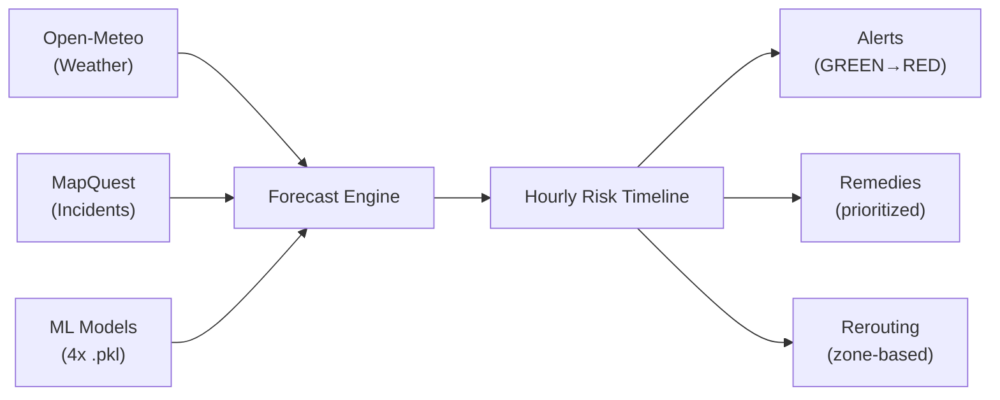

# Traffic Forecaster EWS — Walkthrough

## What Changed

Transformed **UrbanPulse AI** from a manual-input disaster predictor into a **live Traffic Forecaster / Early Warning System** with 7 files (6 new, 1 rewritten):

| File | Purpose |
|---|---|
| [config.py](file:///c:/Users/AArya/Downloads/files%20(1)/config.py) | API endpoints, keys, defaults, alert thresholds |
| [models_forecast.py](file:///c:/Users/AArya/Downloads/files%20(1)/models_forecast.py) | Pydantic models (weather, incidents, forecasts, alerts, remedies) |
| [weather_service.py](file:///c:/Users/AArya/Downloads/files%20(1)/weather_service.py) | Open-Meteo integration (free, no API key) |
| [traffic_incidents_service.py](file:///c:/Users/AArya/Downloads/files%20(1)/traffic_incidents_service.py) | MapQuest Traffic API integration (free tier) |
| [forecast_engine.py](file:///c:/Users/AArya/Downloads/files%20(1)/forecast_engine.py) | Core engine: weather + incidents + ML → hourly risk timeline |
| [remedy_engine.py](file:///c:/Users/AArya/Downloads/files%20(1)/remedy_engine.py) | Remedy catalog + rerouting logic |
| [main.py](file:///c:/Users/AArya/Downloads/files%20(1)/main.py) | FastAPI app with 5 new `/forecast/*` endpoints |

Also fixed a `←` encoding bug in [real_data_ml_model.py](file:///c:/Users/AArya/Downloads/files%20(1)/real_data_ml_model.py) that broke model loading on Windows.

---

## New API Endpoints

| Endpoint | Description |
|---|---|
| `GET /forecast` | **Main EWS** — full risk timeline + alerts + remedies + incidents |
| `GET /forecast/weather` | Raw weather forecast from Open-Meteo |
| `GET /forecast/incidents` | Live traffic incidents from MapQuest |
| `GET /forecast/alerts` | Alert-only view for dashboards |
| `GET /forecast/remedies` | Prioritized remedy suggestions + rerouting |

All endpoints accept `lat`, `lon`, `hours`, and `radius_km` query params.

---

## How It Works



---

## Test Results

Server started with all 4 ML models loaded. All 7 HTTP requests returned **200 OK**.

### `/forecast` — Sample Output (6-hr window, MP India)

- **Max risk score:** 0.314 (YELLOW)
- **Alert:** 1 × YELLOW congestion watch (6 consecutive hours)
- **Remedies generated:** 5 (contraflow lanes, speed limits, diversions, transit, WFH advisory)
- **Risk breakdown per hour:** congestion=0.515, flood=0.0, power_outage=0.04

### `/forecast/weather` — Live Open-Meteo Data
- Temperature: 21.8°C, Humidity: 52%, Wind: 3.4 km/h, Precipitation: 0.0mm
- Timezone auto-detected: `Asia/Kolkata`

### `/forecast/incidents`
- Graceful fallback: returns empty list + warning when `MAPQUEST_API_KEY` is not set

---

## How to Run

```bash
cd "c:\Users\AArya\Downloads\files (1)"
pip install fastapi uvicorn httpx pydantic numpy scikit-learn

# Required for live incidents (optional):
set MAPQUEST_API_KEY=your_key_here

python -m uvicorn main:app --port 8000
```

Then open `http://localhost:8000/docs` for interactive Swagger UI.
